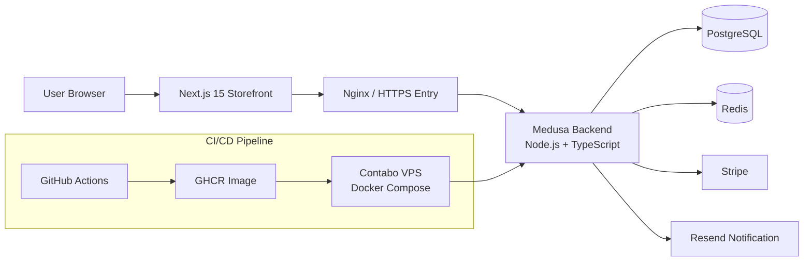

# NordHjem Backend Architecture

## 1. 技术栈概览

NordHjem 采用 Headless 电商架构：前端负责体验与渲染，后端负责商品、订单、支付、库存与运营能力。

| 层级      | 技术                                | 说明                                        |
| --------- | ----------------------------------- | ------------------------------------------- |
| 前端应用  | Next.js 15 + Tailwind CSS           | Storefront（SSR/ISR）与品牌化 UI            |
| 后端应用  | Medusa.js v2 + Node.js + TypeScript | Headless Commerce API、工作流、事件驱动扩展 |
| 数据库    | PostgreSQL                          | 订单、商品、客户、扩展业务数据持久化        |
| 缓存/队列 | Redis                               | 缓存、事件处理、异步任务支持                |
| 容器化    | Docker + Docker Compose             | 本地与部署环境一致化                        |
| CI/CD     | GitHub Actions                      | PR 质量门禁、构建、自动部署                 |
| 部署平台  | Contabo VPS + Docker Compose        | Test/Staging/Production 环境部署与运行      |

---

## 2. 系统架构图



## 请求流（高层）

1. 用户在 Next.js 前端发起浏览、加购、下单请求。
2. 请求通过 API Gateway 进入 Medusa Backend。
3. Medusa 执行业务逻辑（模块、工作流、订阅器），读写 PostgreSQL 与 Redis。
4. 涉及支付时调用 Stripe；涉及通知时调用 Resend。
5. 返回结构化 JSON，前端渲染页面与状态。

---

## 3. 模块划分（`src/modules/`）

当前 `src/modules/` 目录包含以下核心模块：

| 模块                         | 路径                              | 主要职责                                     | 关键依赖                                              |
| ---------------------------- | --------------------------------- | -------------------------------------------- | ----------------------------------------------------- |
| Brand Module                 | `src/modules/brand`               | 品牌实体管理（品牌基础信息、后台品牌管理）   | Sales Channel（通过 link 关联）、Event Bus            |
| Restock Module               | `src/modules/restock`             | 缺货订阅、补货检测、补货通知触发             | Product Variant（link 关联）、Workflows、Notification |
| Ticket Module                | `src/modules/ticket`              | 售后工单与消息记录、SLA 相关字段支撑         | Order Module、Event Bus、Subscribers/Jobs             |
| Resend Notification Provider | `src/modules/resend-notification` | 邮件通知通道适配（模板渲染、发送、错误日志） | Medusa Notification Module、Resend API                |

### 模块间依赖关系

- `brand` 通过 `src/links/brand-sales-channel.ts` 与 Medusa `sales-channel` 形成可写关联，支撑品牌与销售渠道映射。
- `restock` 通过 `src/links/restock-variant.ts` 关联 `productVariant`，并由工作流 `create-restock-subscription` 与 `send-restock-notifications` 组织流程。
- `ticket` 模块主要通过 Admin API 与售后订阅器/定时任务协同，依赖订单域进行工单有效性校验。
- `resend-notification` 为通知基础设施模块，被订单、退款、售后、补货等事件复用。

---

## 4. 数据流

### 4.1 用户请求全链路

1. 前端（Next.js）调用 Store/Admin API（按角色授权）。
2. Medusa 路由层（`src/api/store` / `src/api/admin`）进行参数校验与上下文注入。
3. 路由触发模块服务（`src/modules/*/service.ts`）或工作流（`src/workflows/*`）。
4. 业务执行后写入 PostgreSQL；短期状态和异步处理依赖 Redis。
5. 事件通过 subscribers/jobs 触发后续动作（通知、审计、报表、重试）。

### 4.2 支付流程概述

1. 前端在 checkout 发起支付方法与订单确认请求。
2. Medusa Payment Module 调用 Stripe Provider（`@medusajs/medusa/payment-stripe`）。
3. Stripe 回调（Webhook）由后端 API 处理并更新支付状态。
4. 支付成功后触发订单后续事件：通知、对账、风控审计等。

### 4.3 订单流程概述

1. 用户提交购物车并生成订单。
2. 订单持久化后触发 `order.placed` 等领域事件。
3. Subscribers 执行欢迎邮件、订单通知、库存联动、财务事件等异步任务。
4. 如发生售后场景，Ticket/Return/Refund 相关 API 与订阅器继续驱动流程闭环。

---

## 5. 部署架构

### 5.1 环境划分

| 环境       | 作用                 | 典型分支来源 | 说明                       |
| ---------- | -------------------- | ------------ | -------------------------- |
| test       | 集成验证与自动化冒烟 | `develop`    | 用于快速验证功能与 CI 结果 |
| staging    | 预发布验证           | `staging`    | 接近生产配置，供业务验收   |
| production | 正式流量             | `main`       | 需审批后发布               |

### 5.2 CD Pipeline

```text
develop -> test
staging -> staging
main -> production (approval required)
```

- GitHub Actions 在 PR 阶段执行 lint/typecheck/build/security/AI review。
- 合并后触发对应环境通过 SSH 部署到 Contabo VPS（Docker Compose）。
- 若发布异常，通过回滚到前一稳定镜像标签（`docker pull` + `docker compose up`）恢复服务。

### 5.3 Docker 镜像构建流程

1. 使用 `Dockerfile` 基于 Node 20 构建运行镜像。
2. `npm ci` 安装依赖，`npx medusa build` 生成后端构建产物。
3. CI 将镜像推送到 GitHub Container Registry（GHCR）。
4. CD 通过 SSH 连接 VPS，`docker compose pull` 拉取新镜像并 `docker compose up -d` 滚动更新。

---

## 6. 目录结构说明

### 6.1 `src/` 子目录用途

| 目录               | 用途                                              |
| ------------------ | ------------------------------------------------- |
| `src/api/`         | 自定义 REST API（Store/Admin）、中间件与扩展路由  |
| `src/modules/`     | 自定义业务模块（实体、服务、迁移）                |
| `src/workflows/`   | Medusa Workflow 编排（跨模块业务流程）            |
| `src/subscribers/` | 事件订阅器（订单、支付、售后、安全等）            |
| `src/jobs/`        | 定时任务（补货检测、对账、SLA 检查等）            |
| `src/links/`       | 模块关系定义（自定义模块与 Medusa 核心模块 link） |
| `src/scripts/`     | 一次性脚本（seed、初始化、维护脚本）              |

### 6.2 关键配置文件

| 文件                  | 作用                                                               |
| --------------------- | ------------------------------------------------------------------ |
| `medusa-config.ts`    | Medusa 主配置（数据库、Redis、CORS、模块注册、支付/通知 Provider） |
| `docker-compose.yml`  | 本地开发多服务编排（PostgreSQL/Redis/Medusa）                      |
| `Dockerfile`          | 生产镜像构建定义                                                   |
| `.env.example`        | 环境变量模板（数据库、缓存、密钥、CORS 等）                        |
| `.github/workflows/*` | CI/CD 与质量门禁流水线配置                                         |

---

> 本文档目标：作为 NordHjem 后端架构总览入口，帮助研发、测试与运维在同一语义下协作，并为后续 ADR 与模块设计文档提供索引上下文。
